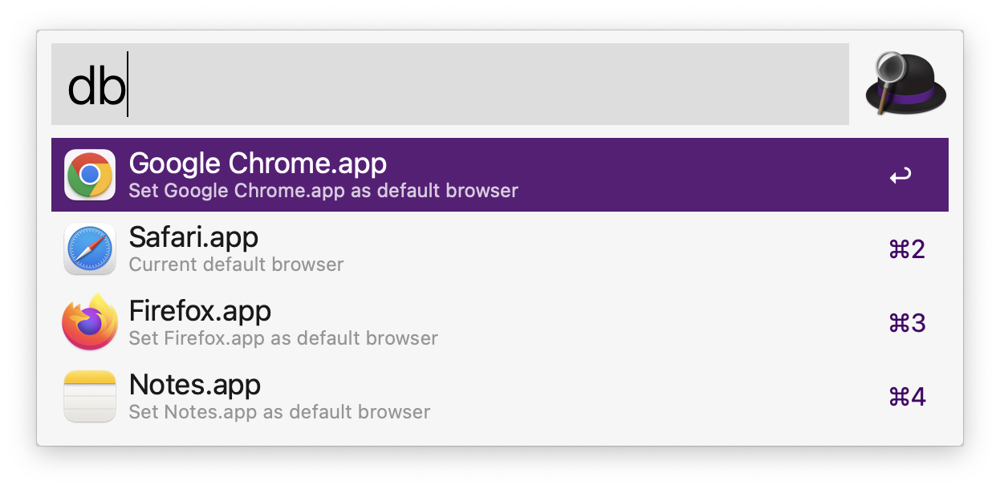

# Py3 Default Browser

This [Alfred](https://www.alfredapp.com) workflow makes it simple to change your default
browser on macOS.

## Installation

To install this workflow you just have to download and open the `.alfredworkflow` file
from the latest
release [here](https://github.com/wmorland/alfred-py3-default-browser/releases/latest).
The Alfred website's Help section has more information about
Workflows [here](https://www.alfredapp.com/help/workflows/#discovering). Workflows are a
paid feature of Alfred which require
the [Alfred Powerpack](https://www.alfredapp.com/powerpack/).

## Usage

The default shortcut is `db` and you can then pick a browser from the list of available
options. macOS requires you to confirm the change in a pop up dialog. For
example: 

### Changing the Alfred keyword

1. Open Alfred Preferences and go to 'Workflows' > 'Py3 Default Browser'.
2. Double click on the Script Filter
   component. 
3. Change the keyword field to your new chosen keyword (you can leave all other fields
   the same) and then click 'Save'.

## Support

If you have any questions or feature requests then
please [file an Issue](https://github.com/wmorland/alfred-py3-default-browser/issues/new)
on GitHub or reach out to me on Twitter, [@w_morland](https://twitter.com/w_morland).

## Contributing

Pull requests are welcome. For major changes, please open an issue first to discuss what
you would like to change.

## Acknowledgements

Thanks to:

- [@deanishe](https://github.com/deanishe) for
  the [alfred-workflow](https://github.com/deanishe/alfred-workflow) library.
- [@NorthIsUp](https://github.com/NorthIsUp) for updating it to Python 3
  in [alfred-workflow-py3](https://github.com/NorthIsUp/alfred-workflow-py3).
- [@kerma](https://github.com/kerma) for
  the [defaultbrowser](https://github.com/kerma/defaultbrowser) tool which was a
  valuable reference.

## Security

- [SECURITY.md](.github/SECURITY.md) (Security Policy)
- [security.txt](.wellknown/security.txt) ([@securitytxt](https://github.com/securitytxt))

## License

[MIT](LICENSE)
